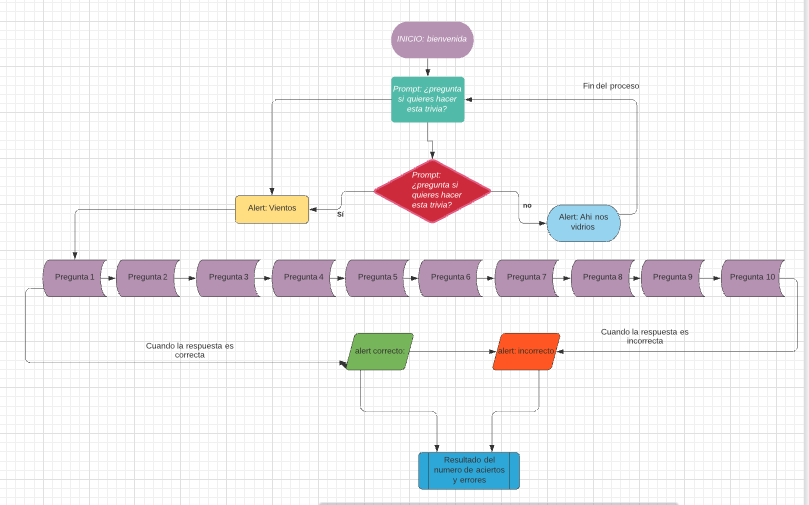

# Tema: Trivia Jerga Latinoamericana

---

**Resumen**: Debido a la globalización  y migración es común que en equipos de trabajo nos encontremos con hispanohablantes de diversas partes de latinoamérica.

**Problema**: En México la mayor parte de la población no entiende el significado y uso de algunas expresiones y palabras del español que hablan en países latinoamericanos.

**Solución**: Dar a conocer a los participantes de esta trivia el significado de algunas de expresiones latinoamericanas.

**Objetivo**: Medir el conocimiento del usuario en la jerga latinoamericana.

---

[Título del Link:(https://github.com/mon0macal7/Trivia_project)]

